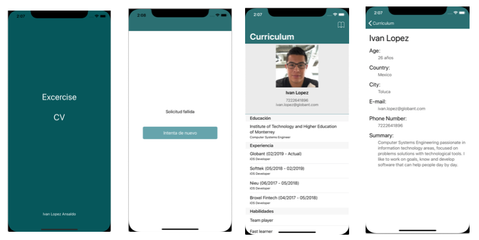

# CV

This repository shows a CV in an iOS application built in Swift.

## Summary

This application is an excercise about my CV.
The app has been built with VIPER architecture using Swift language. 
CV project has two main modules of VIPER called "Curriculum" and "InitialLoader"
In the project you will find UITesting and UnitTesting folders with some use cases of the app.

## Screenshots

### Network

In this sections we will find necessary files to handle all request petitions.
This folder uses a Network, Endpoint, Result and APIError files.

### Curriculum
Curriculum is our main module where all data fetched will be displayed.

### Initial Loader
Initial Loader is our initial module for the app where It will be dedicated to fetch Curriculum data and prepare it to push the model to our next module

